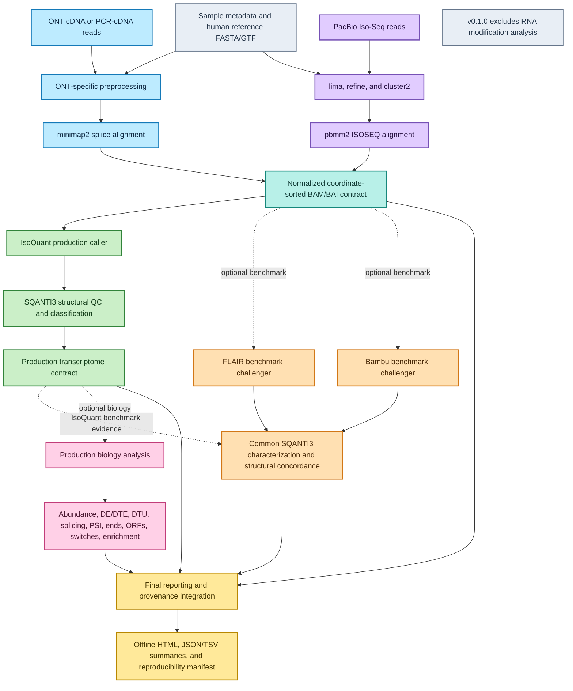

# longread-rnaseq-pipeline

`longread-rnaseq-pipeline` 0.1.0 is a Nextflow DSL2 workflow for human bulk
long-read RNA-seq using Oxford Nanopore cDNA/PCR-cDNA or PacBio Iso-Seq data.
It provides platform-specific preprocessing, aligned-read QC, production
IsoQuant reconstruction, SQANTI3 structural characterization, optional caller
benchmarking, guarded biological analyses, and a deterministic offline report.

The compact validation fixtures establish executable interoperability and
contract integrity. They do not establish biological accuracy or rank callers.

## Supported platforms and scope

| Platform | Supported library | Input | Processing route |
|---|---|---|---|
| ONT | `cdna`, `pcr_cdna` | FASTQ/FASTQ.GZ | NanoPlot, optional Pychopper, minimap2 splice alignment |
| PacBio | `isoseq_hifi` | HiFi/CCS BAM | NanoPlot, lima, refine, cluster2, pbmm2 ISOSEQ |
| PacBio | `isoseq_flnc` | FLNC BAM | NanoPlot, cluster2, pbmm2 ISOSEQ |

The production transcriptome is always IsoQuant followed by SQANTI3. FLAIR and
Bambu are benchmark challengers and never define a majority-vote transcriptome.
RNA modification calling, ONT direct RNA, single-cell/spatial assays,
short-read reconstruction, de novo transcriptomics, and non-human references
are outside v1.

## Architecture



Production and benchmark paths remain separate. All callers use the same
validated BAM, reference FASTA, annotation, and sample metadata. See
[architecture documentation](docs/architecture.md) for contract details.

## Workflow modes

- `default`: Blocks 1–2 plus final report.
- `benchmark`: Block 1, the three-caller Block 3 comparison, and final report.
- `biology`: Blocks 1–2, production-IsoQuant Block 4 analyses, and final report.

There is intentionally no combined `full` mode in v1: the frozen benchmark
subworkflow has its own validated IsoQuant route, and combining it with biology
would duplicate expensive reconstruction. Run `benchmark` and `biology`
against the same normalized inputs when both evidence layers are required.

## Requirements

- Nextflow 24.04.0 or newer; validation used 26.04.6.
- Java 17 or newer.
- Docker for the validated local backend.
- Apptainer/Singularity or an HPC executor may be configured, but these
  backends have not been empirically validated for this release.
- Explicit matching human FASTA and GTF files.

Before benchmark or biology mode, build the pinned local containers:

```bash
docker build -t longread-rnaseq-pipeline/bambu:3.14.0-bioc3.23-r4.6 containers/bambu
docker build -t longread-rnaseq-pipeline/biology:bioc3.23-r4.6 containers/biology
docker build -t longread-rnaseq-pipeline/suppa:2.4 containers/suppa
```

## Quick start

Print concise mode and required-input help without starting a run:

```bash
nextflow run . --help
```

```bash
nextflow run . -resume -profile docker \
  --input samplesheet.csv \
  --fasta references/GRCh38.fa \
  --gtf references/gencode.annotation.gtf \
  --genome_build GRCh38 \
  --annotation_release 'GENCODE release-name' \
  --mode default \
  --outdir results
```

No reference, primer set, annotation, or large biological database is
downloaded implicitly.

## Sample sheet

The exact header is:

```text
sample,platform,library_type,preprocessing,condition,replicate,reads,primer_fasta,primer_pair,ont_kit,require_polya
```

`condition` and `replicate` are always required metadata, but they do not cause
a comparison automatically. Examples are provided for [ONT](assets/samplesheets/ont.example.csv),
[PacBio](assets/samplesheets/pacbio.example.csv),
[mixed platforms](assets/samplesheets/mixed.example.csv), and a
[replicated biology design](assets/samplesheets/biology_replicated.example.csv).
Example paths are illustrative.

Validate a sheet without starting Nextflow:

```bash
python bin/validate_samplesheet.py samplesheet.csv
```

Full field and combination rules are in [input documentation](docs/input.md).

## Reference requirements

The FASTA and GTF must use compatible sequence names and valid coordinates.
Their SHA-256 hashes, declared genome build, annotation release, and contig
compatibility status are recorded. Default alignment is annotation-unguided;
the reserved guided-alignment switch is rejected rather than silently changing
novel-junction discovery.

## ONT example

```bash
nextflow run . -resume -profile docker \
  --input assets/samplesheets/ont.example.csv \
  --fasta references/GRCh38.fa --gtf references/gencode.gtf \
  --genome_build GRCh38 --annotation_release 'GENCODE release-name'
```

When `preprocessing=pychopper`, a supported `ont_kit` is mandatory.

## PacBio example

```bash
nextflow run . -resume -profile docker \
  --input assets/samplesheets/pacbio.example.csv \
  --fasta references/GRCh38.fa --gtf references/gencode.gtf \
  --genome_build GRCh38 --annotation_release 'GENCODE release-name'
```

HiFi input requires a primer FASTA. A multiplexed lima run may require an
explicit `primer_pair`. FLNC input bypasses lima/refine but still runs cluster2.

## Benchmark mode

```bash
nextflow run . -resume -profile docker \
  --mode benchmark --input samplesheet.csv \
  --fasta references/GRCh38.fa --gtf references/gencode.gtf \
  --genome_build GRCh38 --annotation_release 'GENCODE release-name'
```

The report preserves exact structures, intron-chain matches, junction overlap,
transcript-end differences, raw intersections/unions, Jaccards, and explicit
empty-set handling. It does not declare a winning caller.

## Biology mode

```bash
nextflow run . -resume -profile docker \
  --mode biology --input replicated_samples.csv \
  --fasta references/GRCh38.fa --gtf references/gencode.gtf \
  --genome_build GRCh38 --annotation_release 'GENCODE release-name' \
  --contrast_numerator treatment --contrast_denominator control
```

DE, DTE, DTU, differential splicing, and switching run only for explicit,
estimable replicated designs. Otherwise the run succeeds with a documented
`NOT_RUN_*` status. TPM is not used as a substitute for raw counts.

## Outputs and reporting

Important output roots are:

```text
results/
├── alignments/              sorted BAM/BAI
├── qc/                      raw, alignment, and transcript-structure QC
├── isoforms/                production IsoQuant and SQANTI3 outputs
├── transcriptome/           standardized production GTF/FASTA
├── benchmark/               optional three-caller evidence
├── biology/                 optional production biological analyses
├── report/
│   ├── final_report.html    self-contained core report
│   ├── run_summary.json
│   ├── samples.tsv
│   ├── analysis_status.tsv
│   ├── tool_versions.tsv
│   └── multiqc/             deterministic standard-QC report
├── provenance/final/        archive-ready reproducibility bundle
└── pipeline_info/           Nextflow trace, timeline, report, and DAG
```

The custom report consumes Blocks 1–4 contracts. It displays legitimate empty,
disabled, insufficient-design, and sparse-input outcomes explicitly. Core HTML
and CSS work offline, and large BAM/FASTQ files are linked rather than embedded.
See [output documentation](docs/outputs.md).

## Resume behavior

Use `-resume` with the same work directory. Reporting and documentation changes
invalidate reporting tasks only; validated upstream scientific tasks remain
cacheable. Changes to biological parameters, references, sample definitions,
containers, or process code invalidate affected scientific tasks as expected.

## Testing and validation

Three levels are maintained:

1. Fast structural tests: schemas, parsers, contracts, report regressions, and
   release-readiness checks without Docker.
2. Container/stub tests: pinned module environments and Nextflow `-stub-run`.
3. Manual real integration: provenance-documented compact ONT and PacBio
   fixtures, not downloaded by normal CI.

Run the fast Block 5 checks with:

```bash
python tests/contracts/run_block5_report_tests.py
python -B bin/release_readiness.py
```

Detailed real validation evidence is in
[tests/integration/VALIDATION.md](tests/integration/VALIDATION.md).

Block 6 adds an external publication-benchmark framework based on matched
LRGASP WTC11 triplicates and SIRV-Set 4 truth. Its manifests, deterministic
metrics, standalone scoring workflow, source-table plotting, and offline report
are under [validation](validation/README.md); detailed methods and the recorded
storage feasibility decision are in [scientific validation](docs/validation.md).
The full six-sample benchmark is deferred to external storage and is not
presented as a completed local accuracy study.

## Limitations

- Compact fixtures are execution checks, not sensitivity benchmarks.
- Real replicated-condition execution is manifest-defined but remains deferred
  to external storage; deterministic fixtures validate its statistical plumbing.
- Putative TSS/TES sites lack orthogonal CAGE/poly(A) validation.
- ORFs and functional consequences are computational predictions.
- Large homology/domain databases are optional and never downloaded
  automatically.
- Docker is validated; scheduler and Apptainer/Singularity profiles are
  scaffolding only.
- The Block 6 framework is implemented, but publication-scale external-data
  executions remain pending because their audited footprint exceeds local space.

## Reproducibility

Each run records observed versions, container references, reference hashes,
resolved parameters, sample definitions, statuses, and an archive-ready JSON
manifest under `provenance/final/`. The canonical expected-tool registry is
[tool_registry.json](assets/reporting/tool_registry.json). Third-party tools
and containers retain their own licenses; the project license applies only to
this workflow source.

## Citation and license

Citation metadata are provided in [CITATION.cff](CITATION.cff). No DOI has been
assigned. The workflow source is distributed under the [MIT License](LICENSE).
Third-party software remains under its respective upstream terms; see the
[third-party software notice](docs/third-party-software.md).
