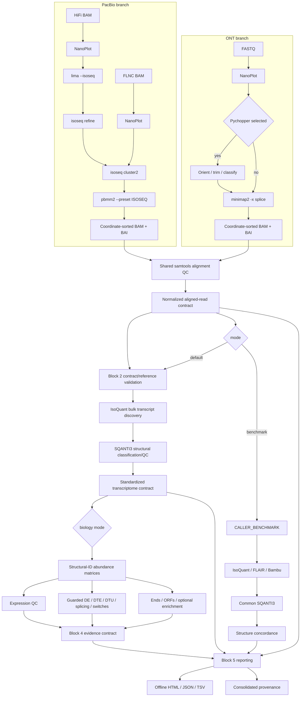

# Architecture

## Platform-specific Block 1 branches

ONT and PacBio are not preprocessed identically. Their histories converge only
after each branch produces a coordinate-sorted BAM, BAI, QC directory, and
normalized manifest.



ONT uses minimap2 `-x splice`, which models introns in long RNA reads. PacBio
uses the pbmm2 `ISOSEQ` preset after Iso-Seq-specific primer processing,
refinement, and clustering. Neither branch is silently annotation-guided.

## Block 1 normalized aligned-read contract

Every completed sample emits:

```text
(
  sample_metadata,
  coordinate_sorted_bam,
  bam_index,
  alignment_qc_directory,
  normalized_manifest_json
)
```

The metadata includes sample ID, platform, library type, condition, replicate,
original input, and selected preprocessing. The manifest records the reference
build/release, preprocessing history, alignment preset, reference-validation
artifact, and observed tool-version aggregate.

Before discovery, Block 2 checks that the contract is complete and that sample,
platform, library type, genome build, annotation release, FASTA checksum, and
GTF checksum agree with the values validated in Block 1. A mismatch fails; no
reference is substituted or repaired.

## Primary isoform discovery

IsoQuant 4.0.0 is the only reconstruction engine in default mode. It receives
the normalized sorted/indexed BAM and therefore performs no realignment.

- ONT samples use IsoQuant `--data_type nanopore`.
- PacBio samples use `--data_type pacbio_ccs`.
- `--mode bulk` is explicit; barcode/UMI and spatial modes are not used.
- Pychopper-classified ONT reads and PacBio clustered transcripts are marked as
  full-length input; an ONT preprocessing bypass is not.
- quantification, transcript discovery, and exon/splice-junction quantification
  outputs are retained.
- model construction and support thresholds use the pinned tool's
  data-type-specific defaults; the workflow does not add a minimum read count.

IsoQuant 4.0.0 does not report novel unspliced ONT models by default, while its
default for other data types is to report them. This tool-native special
treatment is recorded. `--isoquant_report_novel_unspliced` can explicitly
override it, but single-exon models that are reported are never removed by the
workflow.

## Independent structural QC

SQANTI3 6.0.2 consumes the raw IsoQuant transcript-model GTF and the same
reference FASTA/GTF. It is a classification/QC stage, not another caller.
IsoQuant's run-local transcript identifiers are preserved. SQANTI3 ORF
prediction remains at its disabled default because coding-potential analysis
belongs to Block 4. Its optional R HTML report is skipped because the pinned
6.0.2 report script aborts on valid classifications with zero junction rows;
the classification, junction, corrected annotation/FASTA, and standardized
pipeline summaries remain the structural-QC contract.

Machine-readable output preserves SQANTI3's exact `structural_category` values,
including `full-splice_match`, `incomplete-splice_match`, `novel_in_catalog`,
`novel_not_in_catalog`, `genic`, `genic_intron`, `antisense`, and `intergenic`
when present. Categories are counted but not reclassified by pipeline code.

If IsoQuant reports no transcript models for a compact fixture or real sample,
the workflow records `NO_TRANSCRIPT_MODELS`, emits schema-bearing empty
classification/structure artifacts, and does not fabricate classifications.

## Transcript identity

Transcript IDs are run-local labels and are not treated as portable biological
identifiers. The structural identity table records:

- chromosome and strand;
- ordered exon coordinates;
- intron chain;
- transcript start and end;
- exon count and single-exon/multi-exon status;
- transcript length;
- associated SQANTI3 category and reference assignment where available;
- IsoQuant supporting-read count where available.

This is also the basis of Block 3 concordance. Caller IDs remain traceability
labels and never define identity.

## Block 2 standardized transcriptome contract

Each sample emits:

```text
(
  sample_metadata,
  primary_isoquant_gtf,
  transcript_fasta,
  sqanti3_classification_table,
  isoquant_transcript_support_table,
  sqanti3_output_directory,
  structural_summary_json,
  structural_identity_tsv,
  transcriptome_contract_json
)
```

The JSON manifest also points to IsoQuant counts/abundance, SQANTI3 junctions,
Block 1 provenance, observed versions, and reference checksums. Downstream
blocks may use structure and evidence without assuming transcript IDs are
stable across callers or runs.

## Raw and curated transcriptomes

The raw discovered GTF is always retained. Block 2 does not implement a
curation filter; `curated_transcriptome` is therefore null in the contract and
`--transcriptome_filtering true` fails clearly. A later curation policy must
publish a separate artifact and must never overwrite the raw models.

## Multi-sample boundary

Discovery and classification currently run per sample, preserving platform,
library, condition, and replicate. The standardized structures and manifests
provide a future hook for reversible unified-transcriptome construction and
cross-sample/condition support. Block 2 does not merge samples irreversibly or
perform differential analysis.

## Block 3 caller benchmark

`default` runs the frozen Block 1/2 production route. `benchmark` branches from
the same normalized aligned-read contract and validates it once before routing
the identical BAM, BAI, FASTA, GTF, genome build, annotation release, and sample
metadata to the three callers.

- IsoQuant reuses the Block 2 process; there is no duplicate implementation.
- FLAIR 3.0.1 uses `flair transcriptome` directly on the sorted/indexed genome
  BAM. `--noaligntoannot` prevents a separate annotation-transcriptome
  alignment; the reference GTF is therefore reserved for common SQANTI3.
- Bambu 3.14.0 runs per sample with Bioconductor 3.23/R 4.6.1. Discovery and
  quantification are separate so valid discovery survives sparse-input
  quantification edge cases. Its complete discovery object is retained, while
  the comparison universe requires caller-native `readCount >= 1` so the full
  supplied annotation is not mistaken for reconstructed expression.

The same SQANTI3 module and settings are invoked for all three GTFs. Empty GTFs
produce schema-bearing empty classification, FASTA, and junction artifacts.

### Structural matching levels

For multi-exon models, Level A requires chromosome, strand, ordered intron
chain, and exact transcript start/end. Level B drops only the end requirement.
Level C counts shared individual splice junctions, including partial-chain
pairs. Level D records common gene assignments despite structural differences.
The default end tolerance for Level A is zero.

Single-exon models never enter intron-chain or junction metrics. They are
grouped separately by chromosome, strand, and configurable reciprocal genomic
overlap (default 0.5), with exact-coordinate Jaccard also reported.

For every pair of models sharing an intron chain, signed and absolute TSS/TES
differences use transcript orientation (`+`: TSS=start; `-`: TSS=end). Default
absolute bins are exact, <=10, <=25, <=50, and >50 bp. These are configurable
summaries, not biological truth thresholds.

Three-caller membership is derived from standardized structure and emits all
observed all-three, pairwise-only, and caller-only groups. SQANTI3 categories
stratify membership. No intersection is promoted to a consensus transcriptome;
the contract exposes only a future explicit-policy hook.

## Block 4 production biology

`biology` mode invokes the frozen Block 1/2 route and consumes only its
production IsoQuant transcriptome, quantification, SQANTI3 classification, and
standardized structure. Block 3 challenger calls can be attached later as
context, but do not define, filter, vote on, or change significance for the
production transcriptome.

IsoQuant transcript labels are run-local. The abundance layer therefore hashes
chromosome, strand, and the complete ordered exon coordinates into a stable
`LRT_*` structural identifier. Exact structures across samples share a matrix
row; native identifiers remain reversible in `transcript_id_map.tsv`.
Conflicting sequences or gene assignments for the same exact structure fail
instead of being silently merged. Raw integer counts and IsoQuant TPM remain
separate matrices.

No biological comparison is inferred from sample count, condition labels, or
platform. A contrast must explicitly name numerator and denominator. The
default no-intercept design is `~0 + condition`; additional non-confounded
sample-metadata covariates may be supplied. Each condition requires at least
two distinct biological replicate labels. Invalid, absent, under-replicated,
or confounded designs emit `NOT_RUN_*` status metadata while descriptive
outputs continue.

The inferential branches are distinct:

- edgeR 4.10.5 uses raw counts, `filterByExpr`, normalization, robust dispersion
  estimation, and quasi-likelihood GLMs for gene and transcript expression;
- satuRn 1.20.0 tests within-gene transcript usage and marks single-transcript,
  all-zero, missing-gene, and insufficient-expression cases as not testable;
- SUPPA release 2.4 defines its native events, estimates PSI without replacing
  missing values by zero, and runs empirical differential splicing only for a
  valid design;
- IsoformSwitchAnalyzeR 2.12.0 uses its satuRn engine for statistical switches.

Descriptive branches create expression QC, strand-aware observed transcript
starts/ends and configurable putative TSS/TES clusters, and TransDecoder 6.0.0
ORF analysis. `LongOrfs` candidates are retained independently of `Predict`.
Candidate states (`ORF_CANDIDATE_AVAILABLE` and `NO_ORF_CANDIDATE`) are distinct
from run-level `PREDICTION_COMPLETE` and
`PREDICTION_NOT_AVAILABLE_SPARSE_INPUT`; the sparse-input state never creates a
primary ORF or an lncRNA assertion. A genuine `LongOrfs` failure or an
unrecognized `Predict` failure remains fatal. Large homology/Pfam databases are
optional future inputs and are never downloaded automatically.
Human GO enrichment is disabled by default; when enabled it uses the locally
pinned annotation and an explicitly recorded testable background universe.

The integrated table preserves four evidence levels: observed, statistically
inferred, computationally predicted, and externally validated. The last is
empty unless users supply independent evidence. It does not generate narrative
mechanistic claims.

## Block 5 reporting and provenance

Every mode ends in `FINAL_REPORTING`. It consumes stable contracts and never
modifies scientific outputs:

```text
Block 1 normalized contracts and QC
  + Block 2 transcriptome contracts when present
  + Block 3 benchmark contracts when present
  + Block 4 biology contract when present
  + observed versions and reference validation
    -> MultiQC standard-QC aggregation
    -> deterministic custom report
    -> run summary and reproducibility manifest
```

MultiQC 1.35 parses supported NanoPlot and samtools outputs. Automated summary
and update-check network features are disabled. Transcript reconstruction,
concordance, statistical, and prediction summaries are rendered directly from
the pipeline contracts rather than forced into unrelated QC modules.

The custom report is static HTML with embedded CSS and no external runtime
dependency. Its relative links point to large output files without embedding
them. Overall status is `FAILED` only when a required contract or reference
validation is missing or invalid. Legitimate empty, disabled, invalid-design,
and sparse-input states do not fail the run.

The v1 modes are `default`, `benchmark`, and `biology`. A combined mode is not
exposed because the frozen benchmark and production-biology routes would
otherwise repeat IsoQuant reconstruction.

## External Block 6 validation layer

Block 6 does not modify the production graph. It consumes frozen standardized
Block 2/3/4 outputs and explicit external truth:

```text
LRGASP source + source/derived/run manifests
  -> frozen normalized alignment and caller outputs
  -> caller-independent standardized structures
  + hidden SIRV/simulation evaluation truth
  -> exact / intron-chain / junction / end metrics
  -> depth / support / replicate / quantification / resource tables
  -> scripted figures + standalone offline validation report
```

The validation-only Nextflow entry point is `validation/workflow.nf`. It scores
existing standardized structures and deliberately does not expose a new
production mode or change caller parameters. Full data fetch and computation
are external-storage operations guarded by the feasibility audit.

## Execution backends and resources

Process labels define single, low, medium, and high resource classes. The
`max_cpus`, `max_memory`, and `max_time` parameters are enforced through
Nextflow `resourceLimits`. Docker is the validated local backend. Apptainer and
Singularity profiles resolve the same container declarations but remain
unvalidated scaffolding. HPC sites should provide executor, queue, storage, and
container-cache settings in a separate configuration file.
